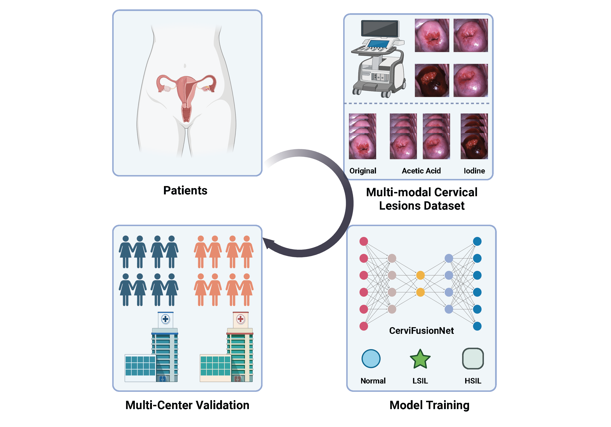
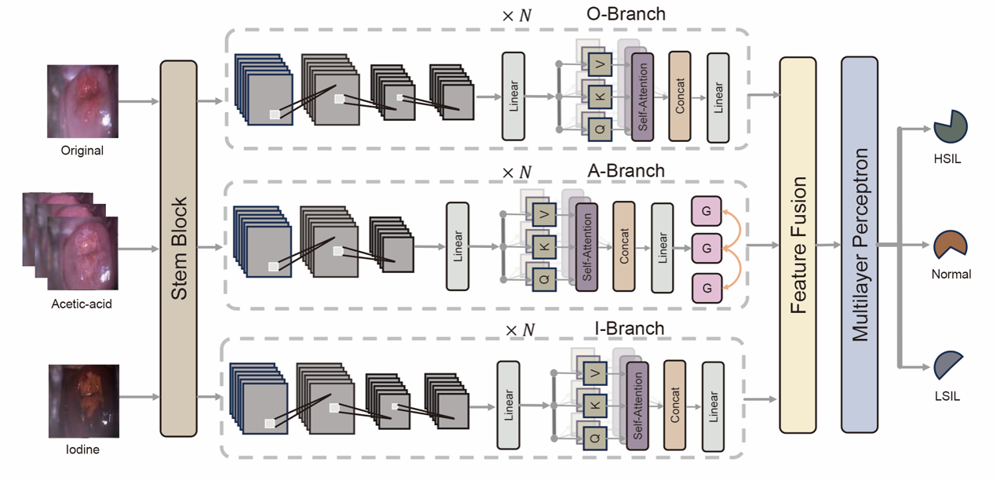
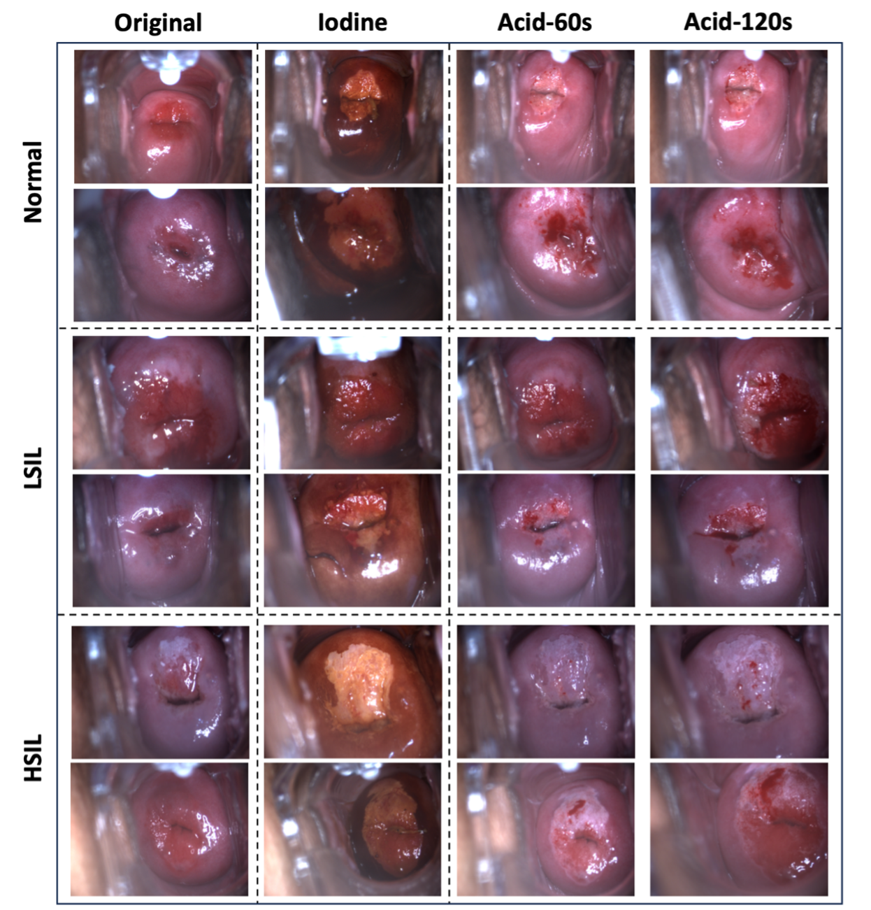

# CerviFusionNet: A Novel Multi-Modal, Hybrid CNN-Transformer-GRU Model for Enhanced Cervical Lesion Multi-classification

## Introduction

In this paper, we proposed a cervical lesions diagnosis method named CerviFusionNet, which is based on deep learning and multi-modal data. Our study represents a significant advancement in the diagnosis of cervical lesions through AI, as evidenced by the following novel contributions:

1. We have curated the first multi-modal colposcopic image dataset for cervical lesions, annotated with labels from highly experienced physicians boasting over a decade of clinical practice. 

2. A pioneering cervical lesion diagnosis model has been developed to process multi-modal colposcope data. Emulating the diagnostic approach of a physician, our model synthesizes information across three distinct modalities to assess patient status and generate accurate diagnostic outcomes.

3. Central to our model are three specialized feature processing branches, each tailored for distinct image types: original colposcopic images, a time series of acetic acid reaction images at 60 and 120 seconds, and iodine staining images. We've innovated a feature processing architecture that merges Convolutional Neural Networks (CNNs) with Vision Transformers, granting it enhanced capabilities for interpreting both local and global image features. Additionally, a Temporal Encoder Module, grounded in the GRU framework, captures and encodes dynamic changes in acetic acid series images, enriching the model's diagnostic precision.

4. Our proposed model outperforms existing single-modality approaches in both accuracy and compactness of design.

## Proposed Method

We propose a cervical cancer diagnosis system based on deep learning and multi-modal data. The proposed cervical lesions diagnosis system contains three inputs, namely the original image, acetic acid reaction sequence, and iodine staining sample. The designed backbone is responsible for extracting robustness representations from these input samples. Then, a Feature Fusion Module is employed to fuse these extracted features and generate refined representations, forcing the model to pay more attention to some important information and enhance the feature discriminability. Finally, the fused representations are mapped into cervical lesions classification results by a multilayer perceptron (MPL), including Normal, LSIL, and HSIL. Details of model structure is shown as follow.

## Mulit-modal Cervical Lesions Dataset

We curated the first multi-modal colposcopy dataset, annotated by highly experienced physicians. It comprises 2,273 anonymous HPV-positive patients examined with three data types original colposcopy images, acetic acid reaction time series at 60 and 120 seconds, and iodine staining images, along with clinical diagnoses and pathology reports. Details of the collected multi-modal dataset is shown as follow.

**Notable:** For privacy and security reasons, the dataset cannot be upload to GitHub or Google Drive. If you are interseted in our project or dataset, please contact with us (syyshayuyang@163.com), or fill in the Application Form in 'images' folder and sent it to me.

